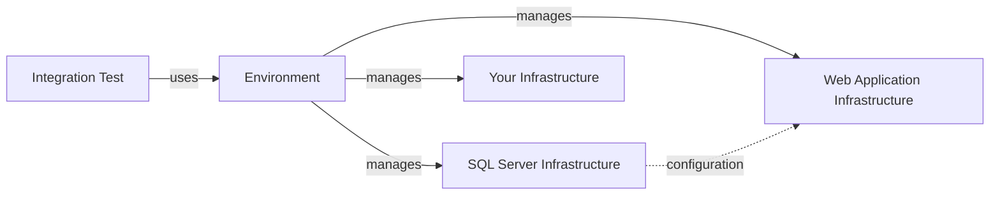
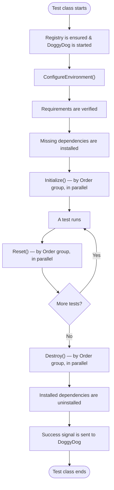
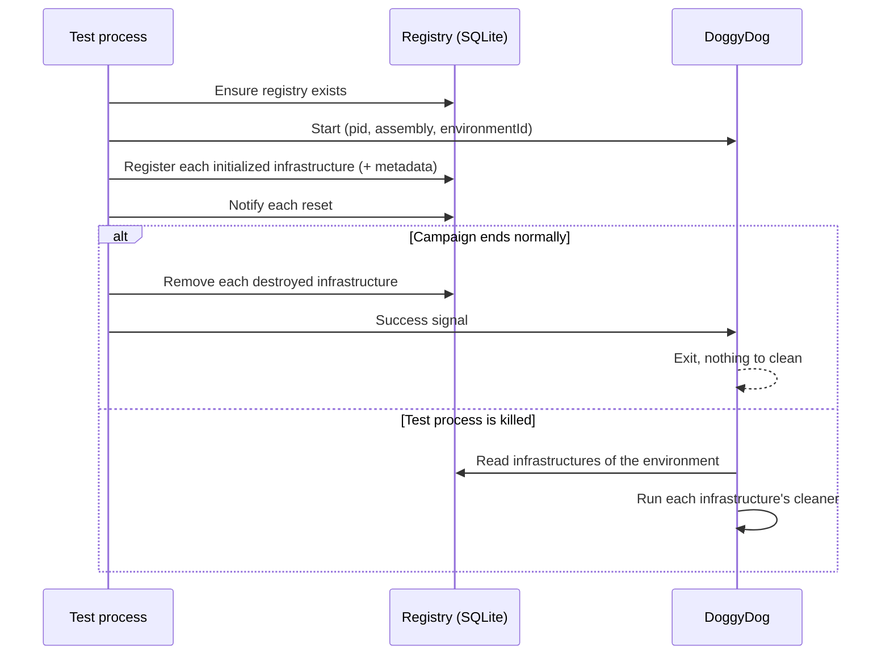

# 🏗️ Core Concepts

NotoriousTest provides a structured way to manage **test infrastructures** and ensure **clean, isolated integration
tests**.
This document introduces the core concepts and how they work together.

## Summary

1. [Infrastructure, Environments, and Tests](#1-infrastructure-environments-and-tests)
    1. [Lifecycle](#11-lifecycle)
    2. [Requirements](#12-requirements)
    3. [Dependencies](#13-dependencies)
    4. [Configuration](#14-configuration)
    5. [Ordering](#15-ordering)
    6. [Environments](#16-environments)
    7. [Integration Test](#17-integration-test)
2. [DoggyDog](#2-doggydog)
3. [Settings](#3-settings)
4. [Dependency Injection](#4-dependency-injection)
5. [Logging](#5-logging)

---

## 1. Infrastructure, Environments, and Tests

NotoriousTest is built around three building blocks:

| Block                | Role                                                                                                                                                                                      |
|----------------------|-------------------------------------------------------------------------------------------------------------------------------------------------------------------------------------------|
| **Infrastructure**   | An external dependency your tests need: a database, a message broker, a web application, a Docker container, a file storage… It knows how to **start**, **reset** and **destroy** itself. |
| **Environment**      | A group of infrastructures. It owns their lifecycle, orders their initialization and shares configuration between them.                                                                   |
| **Integration Test** | A test class bound to an environment. It retrieves infrastructures from the environment and focuses on test logic only.                                                                   |



An infrastructure is a class inheriting from `Infrastructure`:

```csharp
using NotoriousTest.Core;
using NotoriousTest.Core.Infrastructures;
using NotoriousTest.Core.Logger;
using NotoriousTest.Core.Registry;

public class MyInfrastructure : Infrastructure
{
    public MyInfrastructure(EnvironmentId environmentId, ITestLogger logger, IRegistry registry)
        : base(environmentId, logger, registry) { }

    public override Task Initialize()
    {
        // Start the dependency (container, database, server...)
        return Task.CompletedTask;
    }

    public override Task Reset()
    {
        // Restore a clean state (optional, does nothing by default)
        return Task.CompletedTask;
    }

    public override Task Destroy()
    {
        // Release every resource created by Initialize()
        return Task.CompletedTask;
    }
}
```

📌 **Key Points:**

- `Initialize()` and `Destroy()` are **abstract**: you must implement them.
- `Reset()` is **virtual**: override it only if your infrastructure holds state that must be cleaned between tests.
- The constructor parameters (`EnvironmentId`, `ITestLogger`, `IRegistry`) are injected automatically — see
  [Dependency Injection](#4-dependency-injection).
- Each infrastructure instance gets a unique `Id` (`Guid`) and knows the `EnvironmentId` it belongs to.

> 💡 Ready-made infrastructures (SQL Server, PostgreSQL, SQLite, Docker containers, Web applications, Azure
> Functions…) are described in [Integrations](./3-integrations.md).

---

### 1.1 Lifecycle

NotoriousTest drives the lifecycle of every infrastructure for you. No setup or teardown code is needed in your test
classes.



| Step           | When                              | What happens                                                                                                      |
|----------------|-----------------------------------|-------------------------------------------------------------------------------------------------------------------|
| **Initialize** | Once, when the environment starts | `Initialize()` is called on every infrastructure, then the infrastructure is registered in the DoggyDog registry. |
| **Reset**      | After **each** test               | `Reset()` is called on every infrastructure whose `AutoReset` is `true`.                                          |
| **Destroy**    | Once, when the environment ends   | `Destroy()` is called on every infrastructure, then it is removed from the registry.                              |

> ⚠️ An environment lives as long as the **test class** that uses it (it is created as a class fixture in every
> supported framework). Two test classes using the same environment type get two distinct environments, each with its
> own `EnvironmentId`.

**Error handling:** if `Initialize()` throws, NotoriousTest immediately calls `Destroy()` on that infrastructure to
release what was partially created, logs the exception, then rethrows it.

**Disabling the reset** for a specific infrastructure — for example a read-only reference dataset:

```csharp
public class ReferenceDataInfrastructure : Infrastructure
{
    public ReferenceDataInfrastructure(EnvironmentId environmentId, ITestLogger logger, IRegistry registry)
        : base(environmentId, logger, registry)
    {
        AutoReset = false; // Reset() will never be called
    }

    // ...
}
```

Every lifecycle step is logged with its duration (see [Logging](#5-logging)).

---

### 1.2 Requirements

A **requirement** is a piece of software or hardware that **must already be present** on the machine for an
infrastructure to work, and that NotoriousTest **will not install** by itself — typically because it needs elevated
privileges, a reboot or a license (e.g. Docker).

```csharp
public interface IInfrastructureRequirement
{
    Task<bool> Exist();
}
```

Requirements are declared on the infrastructure through the `Requirements` list:

```csharp
using NotoriousTest.Requirements.Docker;

public class RedisInfrastructure : Infrastructure
{
    public RedisInfrastructure(EnvironmentId environmentId, ITestLogger logger, IRegistry registry)
        : base(environmentId, logger, registry)
    {
        Requirements.Add(new DockerRequirement());
    }

    // ...
}
```

📌 **How it works:**

- Right after `ConfigureEnvironment()`, the environment collects the requirements of **all** infrastructures and checks
  them in parallel — **before any infrastructure is initialized**.
- If at least one requirement is not met, an `InfrastructureRequirementNotMetException` is thrown listing every missing
  requirement. Nothing is started, so nothing needs to be cleaned.
- Requirements are de-duplicated with `Equals()`. Override `Equals()` / `GetHashCode()` so that two instances of the
  same requirement are checked only once (as `DockerRequirement` does).

**Available requirements:**

| Package                             | Requirement         | Checks                                                                     |
|-------------------------------------|---------------------|----------------------------------------------------------------------------|
| `NotoriousTest.Requirements.Docker` | `DockerRequirement` | The Docker CLI is installed **and** the daemon is running (`docker info`). |

**Writing your own requirement:**

```csharp
public class NodeRequirement : IInfrastructureRequirement
{
    public async Task<bool> Exist()
    {
        try
        {
            using var process = Process.Start(new ProcessStartInfo("node", "--version")
            {
                RedirectStandardOutput = true,
                UseShellExecute = false,
                CreateNoWindow = true
            })!;
            await process.WaitForExitAsync();
            return process.ExitCode == 0;
        }
        catch (Win32Exception)
        {
            return false; // node not found
        }
    }

    public override bool Equals(object? obj) => obj is NodeRequirement;
    public override int GetHashCode() => typeof(NodeRequirement).GetHashCode();
}
```

---

### 1.3 Dependencies

A **dependency** is a piece of software that an infrastructure needs and that NotoriousTest **can install for you**
before the test campaign, and uninstall afterwards.

```csharp
public interface IInfrastructureDependency
{
    Task Install();
    Task Uninstall();
    Task<bool> Exist();
}
```

Dependencies are declared on the infrastructure through the `Dependencies` list:

```csharp
public class MyFunctionInfrastructure : Infrastructure
{
    public MyFunctionInfrastructure(EnvironmentId environmentId, ITestLogger logger, IRegistry registry)
        : base(environmentId, logger, registry)
    {
        Dependencies.Add(new AzureFunctionCoreToolsDependency());
    }

    // ...
}
```

📌 **How it works:**

1. After the [requirements](#12-requirements) are verified, the environment collects the dependencies of **all**
   infrastructures and calls `Exist()` on each of them.
2. Only the **missing** ones are installed (`Install()`), in parallel, before any infrastructure is initialized.
3. At the end of the campaign, after every infrastructure is destroyed, **only the dependencies NotoriousTest
   installed** are uninstalled (`Uninstall()`). A tool that was already on the machine is never removed.

As with requirements, dependencies are de-duplicated with `Equals()`: override it if several infrastructures may declare
the same dependency.

**Requirement or dependency?**

|                               | Requirement                                                    | Dependency                             |
|-------------------------------|----------------------------------------------------------------|----------------------------------------|
| Checked before initialization | ✅                                                              | ✅                                      |
| Installed by NotoriousTest    | ❌                                                              | ✅ (only if missing)                    |
| Uninstalled at the end        | ❌                                                              | ✅ (only if NotoriousTest installed it) |
| When missing                  | Campaign fails with `InfrastructureRequirementNotMetException` | Installed automatically                |

**Available dependencies:**

| Package                                              | Dependency                         | Installs                                                                                                                 |
|------------------------------------------------------|------------------------------------|--------------------------------------------------------------------------------------------------------------------------|
| `NotoriousTest.Dependencies.Azure.FunctionCoreTools` | `AzureFunctionCoreToolsDependency` | Azure Functions Core Tools (`func` CLI) — `winget` on Windows, `apt-get` on Debian/Ubuntu. Requires elevated privileges. |

> 💡 `AzureFunctionWebApplication` (from `NotoriousTest.Web.AzureFunctions`) already declares
> `AzureFunctionCoreToolsDependency` — you don't need to add it yourself.

---

### 1.4 Configuration

Infrastructures often need to share information: a database produces a connection string that a web application
consumes. NotoriousTest handles this with **configuration entries**.

```csharp
// A key/value pair produced by an infrastructure (key defaults to the value's type name)
new ConfigurationEntry<T>(T value, string? key = null);

// Produces configuration entries
public interface IConfigurationProducer
{
    List<ConfigurationEntry<object>> OutputConfiguration { get; }
}

// Receives every entry produced by the other infrastructures
public interface IConfigurationConsumer
{
    List<ConfigurationEntry<object>> ConsumedConfiguration { get; set; }
}
```

#### Producing configuration

Inherit from `Infrastructure<TOutputConfiguration, TMetadata>` and call `AddEntry()`:

```csharp
public class MyDatabaseInfrastructure : Infrastructure<string, MyDatabaseMetadata>
{
    public MyDatabaseInfrastructure(EnvironmentId environmentId, ITestLogger logger, IRegistry registry)
        : base(environmentId, logger, registry) { }

    public override async Task Initialize()
    {
        string connectionString = await StartDatabase();

        AddEntry("ConnectionStrings:MyDb", connectionString);
    }

    // ...
}
```

- `AddEntry(key, value)` adds an entry with an explicit key.
- `AddEntry(value)` uses the type name of `value` as key.
- `TOutputConfiguration` can be any type: a `string`, or an object that will be flattened into
  colon-separated keys (`"MyDb:ConnectionString"`) by the web integration.

#### Consuming configuration

Implement `IConfigurationConsumer` on any infrastructure:

```csharp
public class MyConsumerInfrastructure : Infrastructure, IConfigurationConsumer
{
    public List<ConfigurationEntry<object>> ConsumedConfiguration { get; set; } = [];

    public override Task Initialize()
    {
        var connectionString = ConsumedConfiguration
            .First(e => e.Key == "ConnectionStrings:MyDb")
            .Value as string;

        // ...
        return Task.CompletedTask;
    }

    // ...
}
```

📌 **How it works:**

- Just before initializing a consumer, the environment aggregates the `OutputConfiguration` of **every** producer and
  assigns it to `ConsumedConfiguration`.
- Within the same [order group](#15-ordering), consumers are always initialized **after** non-consumers, so the
  producers of that group have already filled their entries.
- The web application infrastructures (`NotoriousTest.Web`) are consumers: every entry is injected into the
  application's `IConfiguration`. See [Integrations](./3-integrations.md).

> ⚠️ A consumer only sees entries produced **before** it was initialized. If a producer runs in a later order group,
> its entries will be missing.

---

### 1.5 Ordering

By default, all infrastructures start **in parallel**. Override `Order` when an infrastructure needs another one to be
running first — for example, an identity server (Keycloak) that stores its data in a PostgreSQL database:

```csharp
public class PostgreSqlInfrastructure : Infrastructure
{
    public override int? Order => 1;
    // ...
}

public class KeycloakInfrastructure : Infrastructure
{
    public override int? Order => 2; // starts once PostgreSQL is running
    // ...
}
```

> 💡 Schema creation, migrations or seed data are **not** infrastructures: they belong to the `Initialize()` of the
> infrastructure they apply to (e.g. override `Initialize()` of your database infrastructure, call `base.Initialize()`,
> then run your migrations).

📌 **Rules:**

- Infrastructures are **grouped by `Order`**. Groups run one after another, in ascending order. Infrastructures inside a
  group run in parallel.
- Infrastructures without `Order` (`null`, the default) form the **first** group.
- Inside a group, non-[consumers](#14-configuration) run first, then consumers.
- The same ordering applies to `Initialize()`, `Reset()` and `Destroy()`.
- Web application infrastructures use `Order = 999`, so they start after everything else.

```
Order = null  →  [ Redis , RabbitMQ ]           (parallel)
Order = 1     →  [ PostgreSql ]
Order = 2     →  [ Keycloak , MailServer ]      (parallel)
Order = 999   →  [ WebApplication ]             (consumer)
```

---

### 1.6 Environments

An **environment** groups the infrastructures needed by a set of tests. Inherit from `EnvironmentBase` and register
infrastructures in `ConfigureEnvironment()`:

```csharp
using System.Reflection;
using NotoriousTest.Core.Environments;
using NotoriousTest.Core.Logger;
using NotoriousTest.Core.Registry;
using NotoriousTest.Core.Runtime;
using NotoriousTest.Core.Watchdog;
using NotoriousTest.Web;

public class MyEnvironment : EnvironmentBase
{
    public MyEnvironment(EnvironmentSettings settings, IWatchDog watchDog, IRegistry registry,
        IRuntime runtime, ITestLogger logger, IServiceProvider serviceProvider)
        : base(settings, watchDog, registry, runtime, logger, serviceProvider) { }

    protected override Assembly CurrentAssembly => Assembly.GetExecutingAssembly();

    public override Task ConfigureEnvironment()
    {
        AddInfrastructure<MyDatabaseInfrastructure>();
        this.AddWebApplication<MyWebApplication>();
        return Task.CompletedTask;
    }
}
```

📌 **Key Points:**

- The environment itself is created through [dependency injection](#4-dependency-injection): the constructor parameters
  above are provided automatically, and you can add your own services to them.
- `CurrentAssembly` must return the test assembly. [DoggyDog](#2-doggydog) uses it to find your cleaners after a crash —
  `Assembly.GetExecutingAssembly()` is almost always the right answer.
- Each environment generates a unique `EnvironmentId`, shared by all its infrastructures. Use it to name resources
  (databases, containers…) so that parallel campaigns never collide.

**Registering infrastructures:**

| Method                        | Description                                                                                                                     |
|-------------------------------|---------------------------------------------------------------------------------------------------------------------------------|
| `AddInfrastructure<T>()`      | Creates `T` through the DI container. Every constructor parameter is resolved, and the `EnvironmentId` is passed automatically. |
| `AddInfrastructure(instance)` | Registers an instance you created yourself. Its `EnvironmentId` is overwritten with the environment's one.                      |
| `this.AddWebApplication<T>()` | (`NotoriousTest.Web`) Wraps a web application in a web application infrastructure.                                              |

**Retrieving infrastructures:**

```csharp
var database = Environment.GetInfrastructure<MyDatabaseInfrastructure>();
```

`GetInfrastructure<T>()` returns the first infrastructure assignable to `T` — you can ask for a base class — and
throws `InfrastructureNotFoundException` if none is registered.

---

### 1.7 Integration Test

An **integration test** class is bound to an environment by inheriting the base class of your test framework. The
environment is then available through the `Environment` property.

| Framework  | Package                | Base class                          | Constructor                            |
|------------|------------------------|-------------------------------------|----------------------------------------|
| xUnit (v3) | `NotoriousTest.XUnit`  | `IntegrationTest<TEnvironment>`     | `(XUnitFixture<TEnvironment> fixture)` |
| NUnit      | `NotoriousTest.NUnit`  | `IntegrationTestBase<TEnvironment>` | parameterless                          |
| MSTest     | `NotoriousTest.MSTest` | `IntegrationTestBase<TEnvironment>` | parameterless                          |
| TUnit      | `NotoriousTest.TUnit`  | `IntegrationTestBase<TEnvironment>` | `(TUnitFixture<TEnvironment> fixture)` |

```csharp
// xUnit
public class UserTests : NotoriousTest.XUnit.IntegrationTest<MyEnvironment>
{
    public UserTests(XUnitFixture<MyEnvironment> fixture) : base(fixture) { }

    [Fact]
    public async Task CreateUser_Should_InsertUser()
    {
        HttpClient client = Environment.GetWebApplication().HttpClient;
        var response = await client.PostAsync("users", null);
        Assert.True(response.IsSuccessStatusCode);

        var database = Environment.GetInfrastructure<MyDatabaseInfrastructure>();
        await using var connection = database.GetDatabaseConnection();
        // assert on the database state...
    }
}
```

```csharp
// NUnit
public class UserTests : NotoriousTest.NUnit.IntegrationTestBase<MyEnvironment>
{
    [Test]
    public async Task CreateUser_Should_InsertUser() { /* ... */ }
}

// MSTest
[TestClass]
public class UserTests : NotoriousTest.MSTest.IntegrationTestBase<MyEnvironment>
{
    [TestMethod]
    public async Task CreateUser_Should_InsertUser() { /* ... */ }
}

// TUnit
public class UserTests : NotoriousTest.TUnit.IntegrationTestBase<MyEnvironment>
{
    public UserTests(TUnitFixture<MyEnvironment> fixture) : base(fixture) { }

    [Test]
    public async Task CreateUser_Should_InsertUser() { /* ... */ }
}
```

**How each framework plugs into the lifecycle:**

| Framework | Initialize                                          | Reset                     | Destroy                       |
|-----------|-----------------------------------------------------|---------------------------|-------------------------------|
| xUnit     | `XUnitFixture` (class fixture) `InitializeAsync`    | Test class `DisposeAsync` | `XUnitFixture` `DisposeAsync` |
| NUnit     | `[OneTimeSetUp]`                                    | `[TearDown]`              | `[OneTimeTearDown]`           |
| MSTest    | `[ClassInitialize]`                                 | `[TestCleanup]`           | `[ClassCleanup]`              |
| TUnit     | `TUnitFixture` (shared per class) `InitializeAsync` | `[After(Test)]`           | `TUnitFixture` `DisposeAsync` |

> 💡 Tests of a TUnit integration class are marked `[NotInParallel]`, since they share the same infrastructures and
> are reset between each test.

> ℹ️ `CurrentEnvironment` is obsolete: use `Environment` instead.

---

## 2. DoggyDog

**DoggyDog** 🐶 is a watchdog process that cleans up infrastructures left behind when a test campaign is killed
unexpectedly (crash, forced termination, IDE "stop" button…). Without it, a killed campaign would leave containers,
databases or files behind, since `Destroy()` never runs.

### How it works



1. When the environment initializes, it ensures the registry exists and launches the `DoggyDog` executable (shipped
   with NotoriousTest, next to your test assembly).
2. After `Initialize()`, every infrastructure registers itself — its type, id, environment id, process id and
   **metadata** — in a local SQLite registry (`%LOCALAPPDATA%/notorioustest/doggydog-registry.db`).
3. DoggyDog watches the test process. If it exits **without** a success signal, DoggyDog loads your test assembly
   (`CurrentAssembly`), finds the cleaner of each registered infrastructure and runs it.
4. On a normal end, infrastructures are removed from the registry as they are destroyed, the environment sends a
   success signal and DoggyDog exits without doing anything.

### Defining a cleaner

1. Store what you need to clean up in `Metadata`, by inheriting from `Infrastructure<TMetadata>` (or
   `Infrastructure<TOutputConfiguration, TMetadata>`).
2. Implement `IInfrastructureCleaner<TMetadata>`.
3. Link both with `[Cleaner(typeof(...))]`.

```csharp
public class MyContainerMetadata
{
    public string ContainerId { get; set; } = "";
}

[Cleaner(typeof(MyContainerCleaner))]
public class MyContainerInfrastructure : Infrastructure<MyContainerMetadata>
{
    public MyContainerInfrastructure(EnvironmentId environmentId, ITestLogger logger, IRegistry registry)
        : base(environmentId, logger, registry) { }

    public override async Task Initialize()
    {
        string containerId = await StartContainer();

        // Serialized into the registry, and given back to the cleaner after a crash
        Metadata = new MyContainerMetadata { ContainerId = containerId };
    }

    public override Task Destroy() => RemoveContainer(Metadata!.ContainerId);
}

public class MyContainerCleaner : IInfrastructureCleaner<MyContainerMetadata>
{
    public async Task CleanAfterCrash(EnvironmentId environmentId, Guid infrastructureId,
        MyContainerMetadata? metadata = null)
    {
        if (metadata is null) return;
        await RemoveContainer(metadata.ContainerId);
    }
}
```

📌 **Key Points:**

- The cleaner runs in the DoggyDog process, **not** in your test process: it is created with `Activator.CreateInstance`
  and must have a **parameterless constructor**. Everything it needs must be in the metadata.
- Metadata must be serializable (plain properties).
- `[Cleaner]` is inherited: a class deriving from a built-in infrastructure keeps its cleaner. The built-in Docker and
  database infrastructures already provide one.
- An infrastructure without `[Cleaner]` is simply skipped during recovery.
- Registration happens automatically **after** `Initialize()`. If a crash during `Initialize()` could leave resources
  behind, set `Metadata` and call `await Register()` yourself as early as possible — the automatic registration will
  then be skipped.
- Override `DisableRegistry => true` to keep a specific infrastructure out of the registry.

### Configuration

DoggyDog is configured in [`testsettings.json`](#3-settings).

**Disabling DoggyDog** for the whole test project:

```json
{
  "Environment": {
    "DisableWatchdog": true
  }
}
```

DoggyDog is not started and no registry operation is performed.

**Manual launch (debugging DoggyDog):**

```json
{
  "Watchdog": {
    "ManualLaunch": true
  }
}
```

Instead of starting DoggyDog, the environment writes its launch parameters into **user environment variables**
(`DOGGYDOG_DEBUG_*`) and waits until a `DoggyDog` process is running. Start it yourself — e.g. from your IDE with a
debugger attached — with:

```sh
DoggyDog --from-env
```

---

## 3. Settings

NotoriousTest reads its settings — and your infrastructures' settings — from a `testsettings.json` file in your test
project.

```json
{
  "Environment": {
    "DisableWatchdog": false
  },
  "Watchdog": {
    "ManualLaunch": false
  },
  "SqlServerInfrastructure": {
    "ConnectionString": "Server=localhost;User Id=sa;Password=...;TrustServerCertificate=True"
  }
}
```

The file must be copied to the output directory:

```xml
<ItemGroup>
  <None Update="testsettings.json">
    <CopyToOutputDirectory>PreserveNewest</CopyToOutputDirectory>
  </None>
</ItemGroup>
```

> The file is searched in the test output directory and its sub-directories. If it is missing, every setting keeps its
> default value.

**Built-in sections:**

| Section       | Key               | Default | Description                                        |
|---------------|-------------------|---------|----------------------------------------------------|
| `Environment` | `DisableWatchdog` | `false` | Disables [DoggyDog](#2-doggydog) and the registry. |
| `Watchdog`    | `ManualLaunch`    | `false` | Waits for DoggyDog to be launched manually.        |

External database infrastructures (`SqlServerInfrastructure`, `PostgreInfrastructure`, `SqliteInfrastructure`) read a
section named after **your infrastructure class** — see [Integrations](./3-integrations.md).

### Reading settings in your infrastructures

Inject `ITestSettingsProvider` and bind a section to a class:

```csharp
public class MyApiSettings
{
    public string BaseUrl { get; set; } = "";
}

public class MyApiInfrastructure : Infrastructure
{
    private readonly MyApiSettings _settings;

    public MyApiInfrastructure(EnvironmentId environmentId, ITestSettingsProvider settingsProvider,
        ITestLogger logger, IRegistry registry)
        : base(environmentId, logger, registry)
    {
        _settings = settingsProvider.Get<MyApiSettings>("MyApi")
                    ?? throw new InfrastructureSettingsNotFound("Section MyApi not found.");
    }

    // ...
}
```

| Method        | Description                                                                         |
|---------------|-------------------------------------------------------------------------------------|
| `Get<T>(key)` | Binds the section `key` to a new `T`. Returns `null` if the section does not exist. |
| `Find()`      | Returns the whole `IConfiguration`, for advanced scenarios.                         |

---

## 4. Dependency Injection

Environments and infrastructures are created through a `Microsoft.Extensions.DependencyInjection` container. Any
service registered in it can be requested in their constructor.

**Available by default:**

| Service                 | Description                                                   |
|-------------------------|---------------------------------------------------------------|
| `EnvironmentId`         | Identifier of the current environment (infrastructures only). |
| `ITestLogger`           | Logger writing to the test framework output.                  |
| `ITestSettingsProvider` | Access to [`testsettings.json`](#3-settings).                 |
| `EnvironmentSettings`   | The `Environment` settings section.                           |
| `IRegistry`             | DoggyDog registry.                                            |
| `IWatchDog`             | DoggyDog launcher.                                            |
| `IRuntime`              | .NET runtime resolution, used to launch DoggyDog.             |
| `IServiceProvider`      | The container itself.                                         |
| `TestContext`           | MSTest only.                                                  |

### Registering your own services

1. Create an `IDependencyInjectionConfigurator`:

```csharp
using Microsoft.Extensions.DependencyInjection;
using NotoriousTest.Core.DI;

public class MyInjectionConfigurator : IDependencyInjectionConfigurator
{
    public IServiceCollection ConfigureServices(IServiceCollection services) =>
        services
            .AddSingleton<IMyApiClient, MyApiClient>()
            .AddSingleton(new MyOptions { Timeout = TimeSpan.FromSeconds(30) });
}
```

2. Apply it to your test class with `[InjectionConfigurator]`:

```csharp
[InjectionConfigurator(typeof(MyInjectionConfigurator))]
public class UserTests : NotoriousTest.XUnit.IntegrationTest<MyEnvironment>
{
    public UserTests(XUnitFixture<MyEnvironment> fixture) : base(fixture) { }
}
```

3. Request your services in any infrastructure or environment constructor:

```csharp
public class MyApiInfrastructure : Infrastructure
{
    public MyApiInfrastructure(EnvironmentId environmentId, IMyApiClient client,
        ITestLogger logger, IRegistry registry)
        : base(environmentId, logger, registry) { }

    // ...
}
```

📌 **Key Points:**

- The attribute can be applied **several times**, and on **base classes**: every configurator found on the test class
  hierarchy is applied. Put shared registrations on a common base test class.
- Configurators are created with `Activator.CreateInstance` and need a parameterless constructor.
- The built-in services come from configurators already applied to the framework base classes — you never need to
  register them.
- `EnvironmentId` is not registered in the container: it is passed directly to infrastructures by
  `AddInfrastructure<T>()`. To use it in your own services, give it to them from the infrastructure.

---

## 5. Logging

Every infrastructure exposes a `Logger` property (`ITestLogger`) that writes to the output of your test framework.

```csharp
public override async Task Initialize()
{
    Logger.Log("Starting the database...", EnvironmentId);
    // ...
}
```

Messages are prefixed with the environment id: `[NotoriousTest][<EnvironmentId>]<message>`.

NotoriousTest logs every lifecycle step automatically, with its duration:

```
[NotoriousTest][3f2b...][MyDatabaseInfrastructure] Initialization ...
[NotoriousTest][3f2b...][MyDatabaseInfrastructure] Initialization completed in 2341 ms
[NotoriousTest][3f2b...][MyDatabaseInfrastructure] Reset ...
[NotoriousTest][3f2b...][MyDatabaseInfrastructure] Reset completed in 45 ms
[NotoriousTest][3f2b...][MyDatabaseInfrastructure] Destroy ...
[NotoriousTest][3f2b...][MyDatabaseInfrastructure] Destroy completed in 310 ms
```

**Where logs are written:**

| Framework | Output                                                                                      |
|-----------|---------------------------------------------------------------------------------------------|
| xUnit     | Diagnostic messages — enable them with `"diagnosticMessages": true` in `xunit.runner.json`. |
| NUnit     | `TestContext.Progress`                                                                      |
| MSTest    | `TestContext.WriteLine`                                                                     |
| TUnit     | `TestContext.Current.Output`                                                                |

`ITestLogger` is registered in the [DI container](#4-dependency-injection): inject it into your environment or your own
services as well. DoggyDog writes its own logs in its console window.

---

## ✅ Summary

| Concept                                                          | Description                                                                             |
|------------------------------------------------------------------|-----------------------------------------------------------------------------------------|
| `Infrastructure`                                                 | Base class for any external dependency, with `Initialize()`, `Reset()` and `Destroy()`. |
| `AutoReset`                                                      | Set to `false` to skip `Reset()` for an infrastructure.                                 |
| `IInfrastructureRequirement`                                     | Software that must be present; checked before initialization, never installed.          |
| `IInfrastructureDependency`                                      | Software installed before the campaign if missing, and uninstalled afterwards.          |
| `Infrastructure<TOutputConfiguration, TMetadata>` / `AddEntry()` | Produces configuration entries for other infrastructures.                               |
| `IConfigurationConsumer`                                         | Receives the entries produced by the other infrastructures.                             |
| `Order`                                                          | Groups infrastructures; groups run sequentially, members in parallel.                   |
| `EnvironmentBase`                                                | Groups infrastructures and drives their lifecycle.                                      |
| `IntegrationTest<T>` / `IntegrationTestBase<T>`                  | Binds a test class to an environment.                                                   |
| DoggyDog / `[Cleaner]`                                           | Cleans up infrastructures after an unexpected crash.                                    |
| `testsettings.json` / `ITestSettingsProvider`                    | Settings for NotoriousTest and your infrastructures.                                    |
| `IDependencyInjectionConfigurator` / `[InjectionConfigurator]`   | Registers your own services.                                                            |
| `ITestLogger`                                                    | Logs to the test framework output.                                                      |

---

Now that you understand the fundamentals, check out:

- 🔌 [Integrations](./3-integrations.md) – SQL Server, PostgreSQL, SQLite, TestContainers, Web and Azure Functions.
- 📚 [Examples](./4-example.md) – Hands-on use cases with real-world setups.
- 🏛️ [Architecture Guidelines](./5-architecture.md) – Best practices for structuring your test setup.

💡 Need help or have feedback? Join the
community [discussions](https://github.com/Notorious-Coding/Notorious-Test/discussions)
or open an [issue](https://github.com/Notorious-Coding/Notorious-Test/issues) on GitHub.
