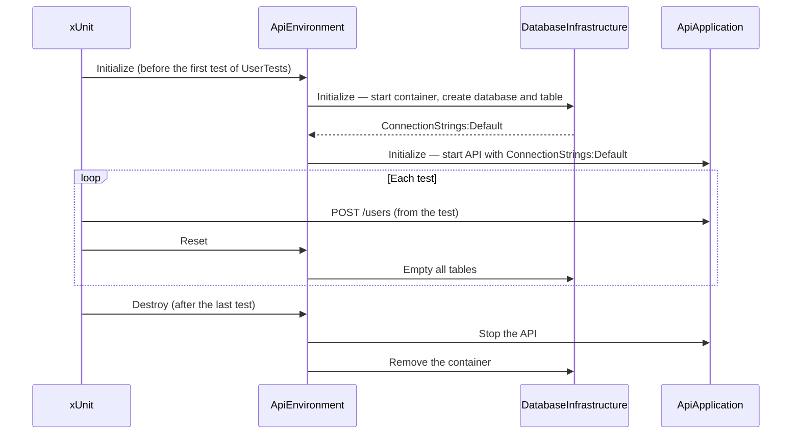

# 📚 Example — Web API + SQL Server

This example is the smallest complete setup: an ASP.NET Core API that saves users into a SQL Server database, tested
end-to-end with a real database running in Docker.

By the end, you will have:

- a SQL Server container started once per test class, with a fresh database;
- your API running in memory, automatically connected to that database;
- the database emptied after each test;
- everything cleaned up at the end — even if the test run crashes.

## Summary

1. [Prerequisites](#1-prerequisites)
2. [The Application Under Test](#2-the-application-under-test)
3. [Setting Up the Test Project](#3-setting-up-the-test-project)
4. [Step 1 — The Database](#4-step-1--the-database)
5. [Step 2 — The Web Application](#5-step-2--the-web-application)
6. [Step 3 — The Environment](#6-step-3--the-environment)
7. [Step 4 — The Tests](#7-step-4--the-tests)
8. [Running the Tests](#8-running-the-tests)
9. [What Just Happened](#9-what-just-happened)
10. [Going Further](#10-going-further)

---

## 1. Prerequisites

- .NET 8 or higher
- Docker, installed and running

---

## 2. The Application Under Test

A minimal API with a single endpoint. It reads its connection string from `IConfiguration`, like any real application —
it knows nothing about the tests.

```csharp
// MyApi/Program.cs
using Microsoft.Data.SqlClient;

var builder = WebApplication.CreateBuilder(args);
var app = builder.Build();

app.MapPost("/users", async (CreateUserRequest request, IConfiguration configuration) =>
{
    await using var connection = new SqlConnection(configuration.GetConnectionString("Default"));
    await connection.OpenAsync();

    await using var command = connection.CreateCommand();
    command.CommandText = "INSERT INTO Users (Name) VALUES (@name)";
    command.Parameters.AddWithValue("@name", request.Name);
    await command.ExecuteNonQueryAsync();

    return Results.Created();
});

app.Run();

public record CreateUserRequest(string Name);

// Makes Program visible to the test project
public partial class Program { }
```

---

## 3. Setting Up the Test Project

Create an xUnit test project, reference the API, and install the packages:

```sh
dotnet new install xunit.v3.templates
dotnet new xunit3 -n MyApi.IntegrationTests
cd MyApi.IntegrationTests
dotnet add reference ../MyApi/MyApi.csproj
dotnet add package NotoriousTest.XUnit
dotnet add package NotoriousTest.SqlServer
dotnet add package NotoriousTest.Web
```

| Package | Why |
|---------|-----|
| `NotoriousTest.XUnit` | Environments and integration tests for xUnit. |
| `NotoriousTest.SqlServer` | A SQL Server database in a Docker container. |
| `NotoriousTest.Web` | Runs the API in memory and connects it to the other infrastructures. |

---

## 4. Step 1 — The Database

Inherit from `SqlServerContainerInfrastructure`, and create the schema once the database is ready:

```csharp
using NotoriousTest.Core;
using NotoriousTest.Core.Logger;
using NotoriousTest.Core.Registry;
using NotoriousTest.SqlServer;

public class DatabaseInfrastructure : SqlServerContainerInfrastructure
{
    public DatabaseInfrastructure(EnvironmentId environmentId, ITestLogger logger, IRegistry registry)
        : base(environmentId, logger, registry) { }

    public override async Task Initialize()
    {
        await base.Initialize(); // starts the container and creates the database

        await using var connection = GetDatabaseConnection();
        await connection.OpenAsync();

        await using var command = connection.CreateCommand();
        command.CommandText = "CREATE TABLE Users (Id INT IDENTITY PRIMARY KEY, Name NVARCHAR(100) NOT NULL)";
        await command.ExecuteNonQueryAsync();
    }
}
```

That is all. The base class also:

- names the database after the environment id, so parallel runs never collide;
- empties every table after each test;
- publishes the connection string as `ConnectionStrings:Default` — the key the API reads;
- removes the container at the end, or after a crash thanks to DoggyDog 🐶.

---

## 5. Step 2 — The Web Application

Point `WebApplication<T>` at the API's `Program` class:

```csharp
using NotoriousTest.Web.Applications;

public class ApiApplication : WebApplication<Program>
{
}
```

The API runs in memory, and receives `ConnectionStrings:Default` from the database infrastructure automatically. No
`appsettings.Testing.json`, no hard-coded connection string.

---

## 6. Step 3 — The Environment

The environment lists the infrastructures the API needs:

```csharp
using System.Reflection;
using NotoriousTest.Core.Environments;
using NotoriousTest.Core.Logger;
using NotoriousTest.Core.Registry;
using NotoriousTest.Core.Runtime;
using NotoriousTest.Core.Watchdog;
using NotoriousTest.Web;

public class ApiEnvironment : EnvironmentBase
{
    public ApiEnvironment(EnvironmentSettings settings, IWatchDog watchDog, IRegistry registry,
        IRuntime runtime, ITestLogger logger, IServiceProvider serviceProvider)
        : base(settings, watchDog, registry, runtime, logger, serviceProvider) { }

    protected override Assembly CurrentAssembly => Assembly.GetExecutingAssembly();

    public override Task ConfigureEnvironment()
    {
        AddInfrastructure<DatabaseInfrastructure>();
        this.AddWebApplication<ApiApplication>();
        return Task.CompletedTask;
    }
}
```

The web application always starts **after** the database: it is guaranteed to receive the connection string.

---

## 7. Step 4 — The Tests

Inherit from `IntegrationTest<ApiEnvironment>`, and use the environment to reach the API and the database:

```csharp
using System.Net;
using System.Net.Http.Json;
using NotoriousTest.Web;
using NotoriousTest.XUnit;

public class UserTests : IntegrationTest<ApiEnvironment>
{
    public UserTests(XUnitFixture<ApiEnvironment> fixture) : base(fixture) { }

    [Fact]
    public async Task CreateUser_Should_ReturnCreated()
    {
        HttpClient client = Environment.GetWebApplication().HttpClient!;

        HttpResponseMessage response = await client.PostAsJsonAsync("users", new { Name = "Alice" });

        Assert.Equal(HttpStatusCode.Created, response.StatusCode);
    }

    [Fact]
    public async Task CreateUser_Should_InsertUserInDatabase()
    {
        HttpClient client = Environment.GetWebApplication().HttpClient!;

        await client.PostAsJsonAsync("users", new { Name = "Bob" });

        Assert.Equal(1, await CountUsers());
    }

    private async Task<int> CountUsers()
    {
        await using var connection = Environment.GetInfrastructure<DatabaseInfrastructure>().GetDatabaseConnection();
        await connection.OpenAsync();

        await using var command = connection.CreateCommand();
        command.CommandText = "SELECT COUNT(*) FROM Users";
        return (int)(await command.ExecuteScalarAsync())!;
    }
}
```

The second test always finds **exactly one** user, whatever the execution order: the database is emptied after each
test.

---

## 8. Running the Tests

```sh
dotnet test
```

```
Passed!  - Failed: 0, Passed: 2, Skipped: 0, Total: 2
```

> 💡 To see NotoriousTest's logs (initialization, reset and destroy durations), add an `xunit.runner.json` file with
> `{ "diagnosticMessages": true }` to the test project, copied to the output directory.

---

## 9. What Just Happened



1. Before the first test of `UserTests`, the environment starts the SQL Server container, creates a database named
   after its `EnvironmentId`, and runs your `CREATE TABLE`.
2. The connection string is published and injected into the API, which starts in memory.
3. After each test, the `Users` table is emptied.
4. After the last test, the API is stopped and the container is removed.
5. If the run is killed in the middle, DoggyDog removes the container for you.

---

## 10. Going Further

- 🏗️ [Core Concepts](./2-core-concepts.md) — lifecycle, ordering, configuration, DoggyDog, settings, dependency
  injection.
- 🔌 [Integrations](./3-integrations.md) — PostgreSQL, SQLite, Docker containers, Azure Functions…
- 🏛️ [Architecture Guidelines](./5-architecture.md) — migrations, test frameworks (Arrange / Act / Assert), project
  structure.
- 🧪 Complete samples for every test framework are available in the
  [`Samples`](../Samples/) folder.

💡 Need help or have feedback? Join the community [discussions](https://github.com/Notorious-Coding/Notorious-Test/discussions)
or open an [issue](https://github.com/Notorious-Coding/Notorious-Test/issues) on GitHub.
