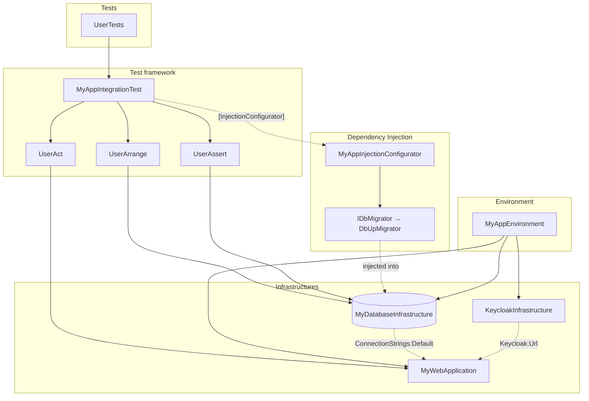

# 🏛️ Architecture Guidelines

NotoriousTest gives you building blocks — infrastructures, environments, dependency injection, integration tests.
This guide explains **where each piece of your test code belongs**, so that your test suite stays readable, fast and
easy to maintain as it grows.

## Summary

1. [Responsibilities at a Glance](#1-responsibilities-at-a-glance)
2. [Infrastructures](#2-infrastructures)
   1. [One Infrastructure, One Running Service](#21-one-infrastructure-one-running-service)
   2. [Schema and Migrations](#22-schema-and-migrations)
   3. [Communicating Between Infrastructures](#23-communicating-between-infrastructures)
   4. [Isolation and Robustness](#24-isolation-and-robustness)
3. [Dependency Injection](#3-dependency-injection)
4. [Environments](#4-environments)
5. [Integration Test Frameworks](#5-integration-test-frameworks)
   1. [Arrange — Seeding Test Data](#51-arrange--seeding-test-data)
   2. [Act — Calling the Application](#52-act--calling-the-application)
   3. [Assert — Verifying State](#53-assert--verifying-state)
   4. [Base Test Class](#54-base-test-class)
   5. [Writing Tests](#55-writing-tests)
6. [Project Structure](#6-project-structure)
7. [The Full Picture](#7-the-full-picture)

---

## 1. Responsibilities at a Glance

| Piece | Responsibility | Changes when… |
|-------|----------------|---------------|
| **Infrastructure** | Brings **one** service online, resets its state, tears it down. | The service changes (image, version, server…). |
| **Dependency Injection** | Provides the tools infrastructures use (migrator, API clients, options…). | You swap a tool or share the setup across projects. |
| **Environment** | Lists the infrastructures the system under test needs. | The system under test needs a new service. |
| **Test framework (Arrange / Act / Assert)** | Speaks the language of your domain: seeds data, calls the app, checks state. | Your API or your data model changes. |
| **Test** | Describes one behavior, as a specification. | The expected behavior changes. |

The rule of thumb: **each piece only knows the piece right below it**. Tests know the test framework, the test framework
knows the environment, the environment knows the infrastructures.

---

## 2. Infrastructures

### 2.1 One Infrastructure, One Running Service

An infrastructure represents **something that runs**: a database server, a message broker, a container, a web
application. Its job is to start it, make it reachable, reset it between tests and shut it down.

✅ **Is an infrastructure:**

- A SQL Server / PostgreSQL database
- A Redis, RabbitMQ, Azurite, Keycloak container
- Your ASP.NET Core API or Azure Functions app
- A mock server standing in for a third-party API

❌ **Is not an infrastructure:**

| Not an infrastructure | Belongs to |
|-----------------------|------------|
| Schema creation, migrations | The `Initialize()` of the database infrastructure — see [Schema and Migrations](#22-schema-and-migrations). |
| Reference data needed by every test | The `Initialize()` of the database infrastructure, protected from reset with `TableToIgnore`. |
| Data needed by one test | The [Arrange](#51-arrange--seeding-test-data) framework. |
| An HTTP client, a repository, a helper | [Dependency Injection](#3-dependency-injection) or the [test framework](#5-integration-test-frameworks). |
| Installing a tool (CLI, runtime…) | A [dependency](./2-core-concepts.md#13-dependencies) declared on the infrastructure. |

> 💡 A good test: if you can't answer "what is running, and how do I stop it?", it is not an infrastructure.

---

### 2.2 Schema and Migrations

The schema is part of "the database is ready to use", so it belongs to the database infrastructure's `Initialize()`.
But **how** the schema is applied (DbUp, FluentMigrator, EF Core, raw scripts…) is a tool choice: inject it through
[dependency injection](#3-dependency-injection) rather than hard-coding it.

```csharp
public interface IDbMigrator
{
    Task Migrate(string connectionString);
}

public class MyDatabaseInfrastructure : SqlServerContainerInfrastructure
{
    private readonly IDbMigrator _migrator;

    public MyDatabaseInfrastructure(EnvironmentId environmentId, ITestLogger logger, IRegistry registry,
        IDbMigrator migrator)
        : base(environmentId, logger, registry)
    {
        _migrator = migrator;
        TableToIgnore = ["SchemaVersions"]; // keep the migration journal across resets
    }

    public override async Task Initialize()
    {
        await base.Initialize();                              // server started, database created
        await _migrator.Migrate(GetDatabaseConnectionString()); // schema applied
    }
}
```

Why it matters:

- The infrastructure stays focused on the server; the migration strategy can change without touching it.
- The **same migrations as production** run in your tests: you test the real schema, not a hand-written copy.
- Migrations run **once** per environment, not before each test. `Reset()` only empties data.

---

### 2.3 Communicating Between Infrastructures

Infrastructures should **not** call each other. When one needs information from another (a connection string, a URL, a
port), use [configuration entries](./2-core-concepts.md#14-configuration):

```csharp
// ✅ The producer publishes what it knows
AddEntry("ConnectionStrings:Keycloak", Container.GetConnectionString());

// ✅ The consumer receives it
public class MyWebApplication : WebApplication<Program> { } // receives every entry automatically
```

```csharp
// ❌ An infrastructure reaching into another one
public override Task Initialize()
{
    var db = _environment.GetInfrastructure<MyDatabaseInfrastructure>(); // hidden coupling
    // ...
}
```

Configuration entries keep infrastructures independent and reusable, and make the dependency visible: the
[ordering](./2-core-concepts.md#15-ordering) guarantees the producer is ready before the consumer starts.

Use the **same keys as your application's `appsettings.json`** (`ConnectionStrings:Default`, `Redis:Host`…): the web
application then receives them with zero mapping code.

---

### 2.4 Isolation and Robustness

- **Name everything after the `EnvironmentId`.** Databases, queues, buckets, files: suffix them with the environment id
  so that parallel test classes and parallel CI jobs never collide. The built-in database infrastructures already do
  it.
- **Keep `Reset()` fast.** It runs after **every** test. Empty data, flush caches, purge queues — never restart a
  container or rerun migrations there.
- **Disable reset when there is nothing to reset.** A read-only service (a mock server with fixed responses) can set
  `AutoReset = false`.
- **Make crashes recoverable.** Anything that outlives the test process (containers, databases, files) should store
  its identifiers in `Metadata` and have a [cleaner](./2-core-concepts.md#2-doggydog). The built-in infrastructures
  already have one.
- **Declare what the machine needs.** Add [requirements](./2-core-concepts.md#12-requirements) (e.g.
  `DockerRequirement`) so a missing tool fails fast with a clear message, and
  [dependencies](./2-core-concepts.md#13-dependencies) for tools NotoriousTest can install.
- **Prefer Docker infrastructures.** They need nothing but Docker, behave the same locally and in CI, and are fully
  isolated. Keep external infrastructures for services that can't run in a container.

---

## 3. Dependency Injection

Dependency injection provides **implementations** to your infrastructures and environments, without coupling them to
concrete classes.

✅ **What belongs here:**

- Migration tools (`DbUp`, `FluentMigrator`, `EF Core`…)
- Clients used by an infrastructure (a Keycloak admin client to create a realm, a storage client to create a bucket…)
- Options shared by several infrastructures

**1. Create a configurator:**

```csharp
public class MyAppInjectionConfigurator : IDependencyInjectionConfigurator
{
    public IServiceCollection ConfigureServices(IServiceCollection services) =>
        services
            .AddSingleton<IDbMigrator, DbUpMigrator>()
            .AddSingleton(new KeycloakOptions { Realm = "my-app" });
}
```

**2. Attach it to your base test class** — see [Base Test Class](#54-base-test-class):

```csharp
[InjectionConfigurator(typeof(MyAppInjectionConfigurator))]
public abstract class MyAppIntegrationTest : NotoriousTest.XUnit.IntegrationTest<MyAppEnvironment> { /* ... */ }
```

**3. Request the services in constructors** — infrastructures or environments.

Because infrastructures depend on interfaces, the same infrastructure can be reused across test projects with different
strategies: one project migrates with EF Core, another with SQL scripts — only the configurator changes.

> 💡 `[InjectionConfigurator]` can be applied several times and on base classes. Put shared registrations on a common
> base class, and project-specific ones on derived classes.

---

## 4. Environments

An environment is the **list of services your system under test needs**. Keep it declarative:

```csharp
public class MyAppEnvironment : EnvironmentBase
{
    public MyAppEnvironment(EnvironmentSettings settings, IWatchDog watchDog, IRegistry registry,
        IRuntime runtime, ITestLogger logger, IServiceProvider serviceProvider)
        : base(settings, watchDog, registry, runtime, logger, serviceProvider) { }

    protected override Assembly CurrentAssembly => Assembly.GetExecutingAssembly();

    public override Task ConfigureEnvironment()
    {
        AddInfrastructure<MyDatabaseInfrastructure>();
        AddInfrastructure<KeycloakInfrastructure>();
        this.AddWebApplication<MyWebApplication>();
        return Task.CompletedTask;
    }
}
```

**Guidelines:**

- **One environment per system under test.** An API and its dependencies form one environment. If you test two APIs
  independently, create two environments.
- **No logic in `ConfigureEnvironment()`.** It lists infrastructures. Setup belongs to the infrastructures, data belongs
  to the tests.
- **Mind the cost.** An environment is created and initialized **per test class**: every class starts its own
  containers and databases. Group tests of the same feature in the same class rather than splitting them into many small
  classes, and keep heavy infrastructures out of environments that don't need them.
- **Variants through inheritance.** If some tests need an extra service, derive a new environment rather than adding it
  to everyone:

```csharp
public class MyAppWithMessagingEnvironment : MyAppEnvironment
{
    public MyAppWithMessagingEnvironment(EnvironmentSettings settings, IWatchDog watchDog, IRegistry registry,
        IRuntime runtime, ITestLogger logger, IServiceProvider serviceProvider)
        : base(settings, watchDog, registry, runtime, logger, serviceProvider) { }

    public override async Task ConfigureEnvironment()
    {
        await base.ConfigureEnvironment();
        AddInfrastructure<RabbitMqInfrastructure>();
    }
}
```

---

## 5. Integration Test Frameworks

As your test suite grows, the same retrieval and setup code gets repeated in many tests. The recommended pattern is to
build **test framework classes** — one per phase of the AAA pattern (Arrange, Act, Assert) — that hold a reference to
the environment and expose domain-oriented methods.

Tests never touch infrastructures directly: they delegate to the framework.

---

### 5.1 Arrange — Seeding Test Data

`Arrange` prepares the state before a test. It writes directly into the infrastructures, bypassing the API, so that a
test only exercises the behavior it is about.

```csharp
public class UserArrange
{
    private readonly MyAppEnvironment _environment;

    public UserArrange(MyAppEnvironment environment) => _environment = environment;

    public async Task<int> ExistingUser(string username, string email)
    {
        var database = _environment.GetInfrastructure<MyDatabaseInfrastructure>();
        await using var connection = (SqlConnection)database.GetDatabaseConnection();
        await connection.OpenAsync();

        await using var command = connection.CreateCommand();
        command.CommandText = """
            INSERT INTO Users (username, email) OUTPUT INSERTED.user_id
            VALUES (@username, @email)
            """;
        command.Parameters.AddWithValue("@username", username);
        command.Parameters.AddWithValue("@email", email);

        return (int)(await command.ExecuteScalarAsync())!;
    }
}
```

> 💡 Return what the test needs next (an id, an entity): tests stay independent from auto-generated values.

---

### 5.2 Act — Calling the Application

`Act` wraps calls to the system under test in meaningful, typed methods. It hides URLs, serialization and `HttpClient`
access.

```csharp
public class UserAct
{
    private readonly MyAppEnvironment _environment;

    public UserAct(MyAppEnvironment environment) => _environment = environment;

    private HttpClient Client => _environment.GetWebApplication().HttpClient!;

    public Task<HttpResponseMessage> CreateUser(string username, string email) =>
        Client.PostAsJsonAsync("users", new { username, email });

    public Task<HttpResponseMessage> DeleteUser(int userId) =>
        Client.DeleteAsync($"users/{userId}");
}
```

---

### 5.3 Assert — Verifying State

`Assert` checks the state of the system after an action. It reads from the infrastructures and expresses expectations
in domain terms.

```csharp
public class UserAssert
{
    private readonly MyAppEnvironment _environment;

    public UserAssert(MyAppEnvironment environment) => _environment = environment;

    public async Task UserCountIs(int expected)
    {
        int actual = await CountUsers("SELECT COUNT(*) FROM Users");
        Xunit.Assert.Equal(expected, actual);
    }

    public async Task UserExists(string username)
    {
        int count = await CountUsers("SELECT COUNT(*) FROM Users WHERE username = @username",
            ("@username", username));
        Xunit.Assert.Equal(1, count);
    }

    private async Task<int> CountUsers(string sql, params (string Name, object Value)[] parameters)
    {
        var database = _environment.GetInfrastructure<MyDatabaseInfrastructure>();
        await using var connection = (SqlConnection)database.GetDatabaseConnection();
        await connection.OpenAsync();

        await using var command = connection.CreateCommand();
        command.CommandText = sql;
        foreach (var (name, value) in parameters)
            command.Parameters.AddWithValue(name, value);

        return (int)(await command.ExecuteScalarAsync())!;
    }
}
```

---

### 5.4 Base Test Class

Create one base test class per environment. It is the **only place** that knows the environment, the DI configurators
and the test framework classes.

```csharp
[InjectionConfigurator(typeof(MyAppInjectionConfigurator))]
public abstract class MyAppIntegrationTest : NotoriousTest.XUnit.IntegrationTest<MyAppEnvironment>
{
    protected MyAppIntegrationTest(XUnitFixture<MyAppEnvironment> fixture) : base(fixture)
    {
        Arrange = new UserArrange(Environment);
        Act = new UserAct(Environment);
        Then = new UserAssert(Environment);
    }

    protected UserArrange Arrange { get; }
    protected UserAct Act { get; }
    protected UserAssert Then { get; }
}
```

> 💡 The assertion framework is exposed as `Then` rather than `Assert`, to avoid hiding your test framework's `Assert`
> class inside tests.

---

### 5.5 Writing Tests

Tests inherit from the base class and read as plain specifications:

```csharp
public class UserTests : MyAppIntegrationTest
{
    public UserTests(XUnitFixture<MyAppEnvironment> fixture) : base(fixture) { }

    [Fact]
    public async Task CreateUser_Should_InsertUser()
    {
        await Act.CreateUser("alice", "alice@example.com");

        await Then.UserExists("alice");
    }

    [Fact]
    public async Task DeleteUser_Should_RemoveExistingUser()
    {
        int userId = await Arrange.ExistingUser("bob", "bob@example.com");

        await Act.DeleteUser(userId);

        await Then.UserCountIs(0);
    }
}
```

📌 **Key Points:**

- Each framework class has one responsibility: Arrange, Act or Assert.
- Tests contain no infrastructure code, no URLs, no SQL.
- Changing a framework method fixes every test that uses it.
- Split frameworks by feature (`UserArrange` / `OrderArrange`…) and expose them all from the base class, or group them
  behind a single `Arrange` facade when they grow.
- No cleanup code in tests: every infrastructure is [reset](./2-core-concepts.md#11-lifecycle) after each test.

---

## 6. Project Structure

A suggested layout for a test project:

```
MyApp.IntegrationTests/
├── Infrastructures/            # One class per running service
│   ├── MyDatabaseInfrastructure.cs
│   ├── KeycloakInfrastructure.cs
│   └── MyWebApplication.cs
├── Environments/
│   └── MyAppEnvironment.cs     # Declarative list of infrastructures
├── DI/
│   ├── MyAppInjectionConfigurator.cs
│   └── DbUpMigrator.cs         # Tools injected into infrastructures
├── Framework/                  # Domain-oriented test helpers
│   ├── Users/
│   │   ├── UserArrange.cs
│   │   ├── UserAct.cs
│   │   └── UserAssert.cs
│   └── MyAppIntegrationTest.cs # Base test class
├── Features/                   # The tests themselves
│   ├── UserTests.cs
│   └── OrderTests.cs
└── testsettings.json
```

When several test projects share the same services, move `Infrastructures/` and `DI/` to a shared library: each
project then only declares its environment, its framework and its tests.

---

## 7. The Full Picture



Each layer has one reason to change:

- **Infrastructures** change when a service changes (image, version, server).
- **DI registrations** change when you swap a tool or share the setup across projects.
- **The environment** changes when the system under test needs a new service.
- **The test framework** changes when your API or data model changes.
- **Tests** change only when the expected behavior changes.

---

💡 Need help or have feedback? Join the community [discussions](https://github.com/Notorious-Coding/Notorious-Test/discussions)
or open an [issue](https://github.com/Notorious-Coding/Notorious-Test/issues) on GitHub.
