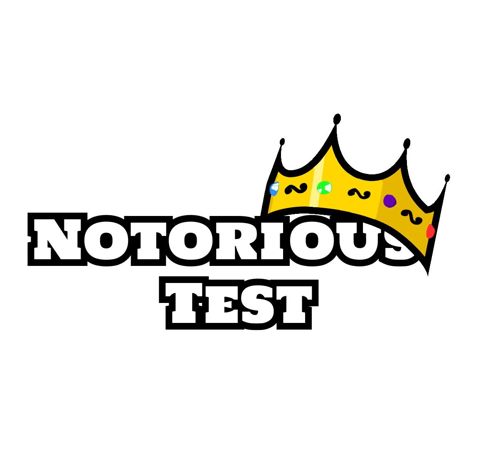

## 


__Clean, isolated, and maintainable integration testing for .NET__

[](https://www.nuget.org/packages/NotoriousTest/)
[](https://www.nuget.org/packages/NotoriousTest/)
[](https://github.com/Notorious-Coding/Notorious-Test/blob/master/LICENSE.txt)
[](https://dotnet.microsoft.com/)
[](https://github.com/Notorious-Coding/Notorious-Test/actions/workflows/release.yml)
[](https://github.com/Notorious-Coding/Notorious-Test/stargazers)

If you plan to use this NuGet package, let me know in the [Tell me if you use that package !](https://github.com/Notorious-Coding/Notorious-Test/discussions/1) discussion on Github ! Gaining insight into its usage is very important to me!

## Summary
- [Why should you use Notorious Test ?](#why-should-you-use-notorious-test-)
- [Why should you not use Notorious Test ?](#why-should-you-not-use-notorious-test-)
- [Purpose](#purpose)
- [Hello World](#hello-world)
  - [Setup](#setup)
  - [Define a Basic Infrastructure](#define-a-basic-infrastructure)
  - [Create a Test Environment](#create-a-test-environment)
  - [Write your first test](#write-your-first-test)
  - [Running Your First Test](#-running-your-first-test)
- [Multi-Framework Support](#multi-framework-support)
- [Resources & Community](#resources--community)
  - [Documentation](#documentation)
  - [Changelog](#changelog)
  - [Contact](#contact)
- [Other packages i'm working on](#other-nugets-im-working-on)

## Why should you use Notorious Test ?

Notorious Test, as every software programming tool, is not made for everyone. It is designed to solve a specific problem, and if you don't have that problem, it may not be the right tool for you.
Notorious Test is made for you if :

- You have a Platform Engineering team, Dev Experience team, that could setup shared infrastructures for your needs and share them as a company framework.
- You are working on code base that handle multiple external dependencies (databases, APIs, message buses, etc.).
- And therefore, your application require a lot of infrastructure configuration (e.g. appsettings.json)
- You want to setup integration test as fast as possible, with a focus on writing tests rather than writing boilerplate code to setup and teardown your environment.
- You are working on a large team and want to have a consistent and maintainable approach to integration testing.
- Your integration tests are not isolated by design (such as multi-tenant applications).
- You can't use Docker (and therefore TestContainers) in your environment, but still want to have a mecanism that clean your environment after a unexpected crash.

If 2 or more of these points apply to you, Notorious Test is probably a good fit for your project.

## Why should you not use Notorious Test ?

- Your application is a small project that doesn't have a lot of external dependencies.
- Integration Tests are not a priority for your project, and you prefer to focus on unit tests or manual testing.
- You don't want to have a dependency on a third-party library for your testing framework.
- TestContainers may be sufficient to all you needs.
- You prefer to mock your dependencies rather than using real ones in your tests.

## Purpose

Notorious Test is a testing framework designed to simplify the setup and management of integration tests in .NET applications.
It provides a structured way to define and manage test environments, allowing developers to focus on writing tests rather than dealing with the complexities of infrastructure setup and teardown.

The concept is simple:

1. Create an **infrastructure** and implement its _initialization_, _reset_, and _destruction_ logic.
2. Add it to an **environment**.
3. Access it directly from your **integration tests**.

**NotoriousTest** will automatically manage the **lifecycle of your infrastructures.**
Even after the tests have crashed unexpectedly, thanks to the DoggyDog 🐶.

## Hello World

## Setup

First, [install NuGet](http://docs.nuget.org/docs/start-here/installing-nuget). Then, install the package matching your test framework:

| Framework | Package |
|-----------|---------|
| xUnit | `NotoriousTest.XUnit` |
| NUnit | `NotoriousTest.NUnit` |
| MSTest | `NotoriousTest.MSTest` |
| TUnit | `NotoriousTest.TUnit` |

```
PM> Install-Package NotoriousTest.XUnit
```

Or from the .NET CLI:

```
dotnet add package NotoriousTest.XUnit
```

> **Note:** .NET 8 or higher is required.

## Define a Basic Infrastructure

An **infrastructure** represents an **external dependency** (database, message bus, etc.).

For now, we'll define an empty infrastructure to illustrate the setup.
You can replace `MyInfrastructure` with any real infrastructure later.

```csharp
public class MyInfrastructure : Infrastructure
{
    public override Task Initialize()
    {
        // Setup logic here (e.g., start a database, configure an API)
        Console.WriteLine($"Setup of {nameof(MyInfrastructure)}");
        return Task.CompletedTask;
    }

    public override Task Reset()
    {
        // Reset logic here (e.g., clear data, reset state)
        Console.WriteLine($"Reset of {nameof(MyInfrastructure)}");
        return Task.CompletedTask;
    }

    public override Task Destroy()
    {
        // Cleanup logic here (e.g., shut down services)
        Console.WriteLine($"Shutdown of {nameof(MyInfrastructure)}");
        return Task.CompletedTask;
    }
}
```

**📌 What this does:**

- Defines a basic infrastructure with lifecycle methods.
- This is where you would add setup logic for databases, APIs, queues, etc.

## Create a Test Environment

A test environment groups infrastructures together. Extend the environment class from your framework-specific package:

```csharp
// xUnit
using System.Reflection;
using Xunit.Sdk;

public class MyTestEnvironment : NotoriousTest.XUnit.Environment
{
    public MyTestEnvironment(IMessageSink sink) : base(sink) { }

    public override Assembly CurrentAssembly => Assembly.GetExecutingAssembly();

    public override async Task ConfigureEnvironment()
    {
        AddInfrastructure<MyInfrastructure>();
    }
}
```

📌 **What this does:**

- Registers `MyInfrastructure` inside the test environment.
- Ensures all tests run in a clean and isolated setup.

> See [Multi-Framework Support](#multi-framework-support) for NUnit, MSTest, and TUnit equivalents.

## Write your first test

Now, let's write a basic integration test using our environment.

```csharp
// xUnit
public class MyIntegrationTests : NotoriousTest.XUnit.IntegrationTest<MyTestEnvironment>
{
    public MyIntegrationTests(MyTestEnvironment environment) : base(environment) { }

    [Fact]
    public async Task ExampleTest()
    {
        // Retrieve the infrastructure
        var infra = CurrentEnvironment.GetInfrastructure<MyInfrastructure>();

        // Add test logic here (e.g., verify database state, call an API)

        Assert.NotNull(infra); // Basic validation to confirm setup works
    }
}
```

📌 **What this does:**

- Retrieves the test infrastructure from the environment.
- You can add real test logic (API calls, database assertions, etc.).

## 🚀 Running Your First Test

Now, let's run the test:

```sh
dotnet test
```

### Expected Output

You should see something like:

```sh
Passed! 1 test successful.
```

If everything works, congrats! 🎉 You've successfully set up NotoriousTest.

## Multi-Framework Support

NotoriousTest supports **xUnit**, **NUnit**, **MSTest**, and **TUnit**. The environment and test base classes differ per framework — everything else is identical.

### NUnit

```csharp
// Environment
public class MyTestEnvironment : NotoriousTest.NUnit.Environment
{
    public override Assembly CurrentAssembly => Assembly.GetExecutingAssembly();

    public override async Task ConfigureEnvironment()
    {
        AddInfrastructure<MyInfrastructure>();
    }
}

// Tests
[TestFixture]
public class MyIntegrationTests : NotoriousTest.NUnit.IntegrationTest<MyTestEnvironment>
{
    [Test]
    public async Task ExampleTest()
    {
        var infra = CurrentEnvironment.GetInfrastructure<MyInfrastructure>();
        Assert.That(infra, Is.Not.Null);
    }
}
```

### MSTest

```csharp
// Environment
public class MyTestEnvironment : NotoriousTest.MSTest.Environment
{
    public override Assembly CurrentAssembly => Assembly.GetExecutingAssembly();

    public override async Task ConfigureEnvironment()
    {
        AddInfrastructure<MyInfrastructure>();
    }
}

// Tests
[TestClass]
public class MyIntegrationTests : NotoriousTest.MSTest.IntegrationTest<MyTestEnvironment>
{
    [TestMethod]
    public async Task ExampleTest()
    {
        var infra = CurrentEnvironment.GetInfrastructure<MyInfrastructure>();
        Assert.IsNotNull(infra);
    }
}
```

### TUnit

```csharp
// Environment
public class MyTestEnvironment : NotoriousTest.TUnit.Environment
{
    public override Assembly CurrentAssembly => Assembly.GetExecutingAssembly();

    public override async Task ConfigureEnvironment()
    {
        AddInfrastructure<MyInfrastructure>();
    }
}

// Tests
public class MyIntegrationTests : NotoriousTest.TUnit.IntegrationTest<MyTestEnvironment>
{
    public MyIntegrationTests(MyTestEnvironment environment) : base(environment) { }

    [Test]
    public async Task ExampleTest()
    {
        var infra = CurrentEnvironment.GetInfrastructure<MyInfrastructure>();
        await Assert.That(infra).IsNotNull();
    }
}
```

## Resources & Community

### Documentation

- 📖 [Core Concepts](./Documentation/2-core-concepts.md) – Learn how infrastructures and environments work.
- 🔌 [Integrations](./Documentation/3-integrations.md) – See how to integrate SQL Server, TestContainers, and more.
- 📚 [Examples](./Documentation/4-example.md) – Hands-on use cases with real-world setups.
- 🏛️ [Architecture Guidelines](./Documentation/5-architecture.md) – Best practices for structuring your test setup.

### Changelog

You can find the changelog [here](./CHANGELOG.md).

### Contact

Have questions, ideas, or feedback about NotoriousTest?
Feel free to reach out! I'd love to hear from you. Here's how you can get in touch:

- GitHub Issues: [Open an issue](https://github.com/Notorious-Coding/Notorious-Test/issues) to report a problem, request a feature, or share an idea.
- Email: [briceschumacher21@gmail.com](mailto:briceschumacher21@gmail.com)
- LinkedIn : [Brice SCHUMACHER](http://www.linkedin.com/in/brice-schumacher)

The discussions tabs is now opened !
Feel free to tell me if you use the package here : https://github.com/Notorious-Coding/Notorious-Test/discussions/1 !

## Other nugets i'm working on

- [**NotoriousClient**](https://www.nuget.org/packages/NotoriousClient/) : Notorious Client is meant to simplify the sending of HTTP requests through a fluent builder and an infinitely extensible client system.
- [**NotoriousModules**](https://github.com/Notorious-Coding/Notorious-Modules) : Notorious Modules provide a simple way to separate monolith into standalone modules.
