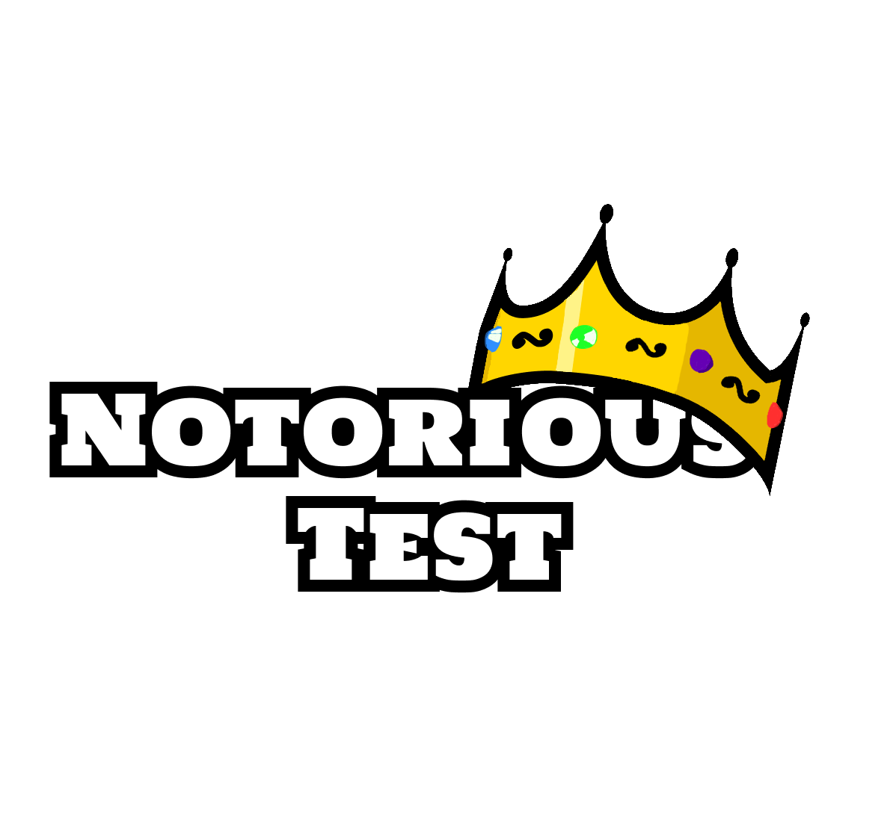

## 

__Clean, isolated, and maintainable integration testing for .NET__

[](https://www.nuget.org/packages/NotoriousTest/)
[](https://www.nuget.org/packages/NotoriousTest/)
[](https://github.com/Notorious-Coding/Notorious-Test/blob/master/LICENSE.txt)
[](https://dotnet.microsoft.com/)
[](https://github.com/Notorious-Coding/Notorious-Test/actions/workflows/release.yml)
[](https://github.com/Notorious-Coding/Notorious-Test/stargazers)

If you plan to use this NuGet package, let me know in
the [Tell me if you use that package !](https://github.com/Notorious-Coding/Notorious-Test/discussions/1) discussion on
Github ! Gaining insight into its usage is very important to me!

## Summary

- [Purpose](#purpose)
- [Installation](#installation)
- [Quick Start](#quick-start)
  - [1. The Database](#1-the-database)
  - [2. The Web Application](#2-the-web-application)
  - [3. The Environment](#3-the-environment)
  - [4. The Tests](#4-the-tests)
- [Multi-Framework Support](#multi-framework-support)
- [Integrations](#integrations)
- [Resources & Community](#resources--community)
  - [Documentation](#documentation)
  - [Changelog](#changelog)
  - [Contact](#contact)
- [Other packages i'm working on](#other-nugets-im-working-on)

## Purpose

Integration tests are valuable, but their setup is painful: starting databases, wiring connection strings, cleaning
data between tests, tearing everything down — and ending up with orphan containers when a run crashes.

**NotoriousTest** handles all of that for you. The concept is simple:

1. Describe each external dependency (database, container, web application…) as an **infrastructure**.
2. Group them in an **environment**.
3. Write **integration tests** against that environment.

NotoriousTest then manages the whole lifecycle:

- ⚡ **Initialize** infrastructures before the tests — in parallel, in order when needed.
- 🔗 **Share configuration** between them: your API receives the database connection string automatically.
- 🧹 **Reset** them after each test, so every test starts from a clean state.
- 🗑️ **Destroy** them at the end.
- 🐶 **Clean up after crashes** thanks to DoggyDog, a watchdog process that removes whatever a killed run left behind.

It works with **xUnit**, **NUnit**, **MSTest** and **TUnit**, and ships ready-to-use infrastructures for **SQL Server**,
**PostgreSQL**, **SQLite**, **Docker containers**, **ASP.NET Core** and **Azure Functions**.

## Installation

Install the package matching your test framework:

| Framework | Package |
|-----------|---------|
| xUnit (v3) | `NotoriousTest.XUnit` |
| NUnit | `NotoriousTest.NUnit` |
| MSTest | `NotoriousTest.MSTest` |
| TUnit | `NotoriousTest.TUnit` |

Then the [integrations](#integrations) you need:

```sh
dotnet add package NotoriousTest.XUnit
dotnet add package NotoriousTest.SqlServer
dotnet add package NotoriousTest.Web
```

> **Note:** .NET 8 or higher is required. Docker-based infrastructures require Docker to be installed and running.

## Quick Start

Let's test an ASP.NET Core API that saves users into SQL Server, against a real database running in Docker.

```csharp
// The API under test — Program.cs
app.MapPost("/users", async (CreateUserRequest request, IConfiguration configuration) =>
{
    await using var connection = new SqlConnection(configuration.GetConnectionString("Default"));
    // INSERT INTO Users ...
    return Results.Created();
});

public partial class Program { } // makes Program visible to the test project
```

### 1. The Database

An **infrastructure** that starts SQL Server in a container and creates the schema:

```csharp
public class DatabaseInfrastructure : SqlServerContainerInfrastructure
{
    public DatabaseInfrastructure(EnvironmentId environmentId, ITestLogger logger, IRegistry registry)
        : base(environmentId, logger, registry) { }

    public override async Task Initialize()
    {
        await base.Initialize(); // starts the container and creates the database

        await using var connection = GetDatabaseConnection();
        await connection.OpenAsync();

        await using var command = connection.CreateCommand();
        command.CommandText = "CREATE TABLE Users (Id INT IDENTITY PRIMARY KEY, Name NVARCHAR(100) NOT NULL)";
        await command.ExecuteNonQueryAsync();
    }
}
```

It publishes its connection string as `ConnectionStrings:Default` and empties every table after each test.

### 2. The Web Application

Your API, running in memory:

```csharp
public class ApiApplication : WebApplication<Program>
{
}
```

It receives `ConnectionStrings:Default` from the database automatically — no configuration file needed.

### 3. The Environment

The **environment** lists the infrastructures your tests need:

```csharp
public class ApiEnvironment : EnvironmentBase
{
    public ApiEnvironment(EnvironmentSettings settings, IWatchDog watchDog, IRegistry registry,
        IRuntime runtime, ITestLogger logger, IServiceProvider serviceProvider)
        : base(settings, watchDog, registry, runtime, logger, serviceProvider) { }

    protected override Assembly CurrentAssembly => Assembly.GetExecutingAssembly();

    public override Task ConfigureEnvironment()
    {
        AddInfrastructure<DatabaseInfrastructure>();
        this.AddWebApplication<ApiApplication>(); // always starts after the database
        return Task.CompletedTask;
    }
}
```

### 4. The Tests

```csharp
public class UserTests : IntegrationTest<ApiEnvironment>
{
    public UserTests(XUnitFixture<ApiEnvironment> fixture) : base(fixture) { }

    [Fact]
    public async Task CreateUser_Should_InsertUserInDatabase()
    {
        HttpClient client = Environment.GetWebApplication().HttpClient!;

        await client.PostAsJsonAsync("users", new { Name = "Alice" });

        await using var connection = Environment.GetInfrastructure<DatabaseInfrastructure>().GetDatabaseConnection();
        await connection.OpenAsync();
        await using var command = connection.CreateCommand();
        command.CommandText = "SELECT COUNT(*) FROM Users";

        Assert.Equal(1, (int)(await command.ExecuteScalarAsync())!);
    }
}
```

```sh
dotnet test
```

That's it 🎉 The container starts before the first test, the table is emptied after each test, and everything is
removed at the end — even if the run crashes.

👉 The full step-by-step walkthrough, with every `using` and an explanation of each step, is in the
[Example](./Documentation/4-example.md).

## Multi-Framework Support

Infrastructures and environments are identical for every framework. Only the test base class changes:

| Framework | Base class | Constructor |
|-----------|------------|-------------|
| xUnit (v3) | `NotoriousTest.XUnit.IntegrationTest<TEnvironment>` | `(XUnitFixture<TEnvironment> fixture)` |
| NUnit | `NotoriousTest.NUnit.IntegrationTestBase<TEnvironment>` | parameterless |
| MSTest | `NotoriousTest.MSTest.IntegrationTestBase<TEnvironment>` | parameterless |
| TUnit | `NotoriousTest.TUnit.IntegrationTestBase<TEnvironment>` | `(TUnitFixture<TEnvironment> fixture)` |

```csharp
// NUnit
public class UserTests : NotoriousTest.NUnit.IntegrationTestBase<ApiEnvironment>
{
    [Test]
    public async Task CreateUser_Should_InsertUserInDatabase() { /* same as above */ }
}

// MSTest
[TestClass]
public class UserTests : NotoriousTest.MSTest.IntegrationTestBase<ApiEnvironment>
{
    [TestMethod]
    public async Task CreateUser_Should_InsertUserInDatabase() { /* same as above */ }
}

// TUnit
public class UserTests : NotoriousTest.TUnit.IntegrationTestBase<ApiEnvironment>
{
    public UserTests(TUnitFixture<ApiEnvironment> fixture) : base(fixture) { }

    [Test]
    public async Task CreateUser_Should_InsertUserInDatabase() { /* same as above */ }
}
```

Complete samples for each framework are available in the [`Samples`](./Samples/) folder.

## Integrations

| Package | Provides |
|---------|----------|
| `NotoriousTest.Web` | ASP.NET Core application running in memory. |
| `NotoriousTest.Web.AzureFunctions` | Azure Functions host running locally. |
| `NotoriousTest.SqlServer` | SQL Server — Docker container or existing server. |
| `NotoriousTest.PostgreSql` | PostgreSQL — Docker container or existing server. |
| `NotoriousTest.Sqlite` | SQLite — one database file per environment. |
| `NotoriousTest.TestContainers` | Any [Testcontainers](https://dotnet.testcontainers.org/) container (Redis, RabbitMQ, Keycloak…). |
| `NotoriousTest.Requirements.Docker` | Fails fast when Docker is not running. |
| `NotoriousTest.Dependencies.Azure.FunctionCoreTools` | Installs the Azure Functions Core Tools when missing. |

Need something else? Any class inheriting from `Infrastructure` is an infrastructure — see
[Core Concepts](./Documentation/2-core-concepts.md).

## Resources & Community

### Documentation

- 🏗️ [Core Concepts](./Documentation/2-core-concepts.md) – Infrastructures, environments, lifecycle, DoggyDog, settings,
  dependency injection.
- 🔌 [Integrations](./Documentation/3-integrations.md) – SQL Server, PostgreSQL, SQLite, Docker containers, Web, Azure
  Functions.
- 📚 [Example](./Documentation/4-example.md) – A complete Web API + SQL Server setup, step by step.
- 🏛️ [Architecture Guidelines](./Documentation/5-architecture.md) – Best practices for structuring your test setup.

### Changelog

You can find the changelog [here](./CHANGELOG.md).

### Contact

Have questions, ideas, or feedback about NotoriousTest?
Feel free to reach out! I'd love to hear from you. Here's how you can get in touch:

- GitHub Issues: [Open an issue](https://github.com/Notorious-Coding/Notorious-Test/issues) to report a problem, request
  a feature, or share an idea.
- Email: [briceschumacher21@gmail.com](mailto:briceschumacher21@gmail.com)
- LinkedIn : [Brice SCHUMACHER](http://www.linkedin.com/in/brice-schumacher)

The discussions tabs is now opened !
Feel free to tell me if you use the package here : https://github.com/Notorious-Coding/Notorious-Test/discussions/1 !

## Other nugets i'm working on

- [**NotoriousClient**](https://www.nuget.org/packages/NotoriousClient/) : Notorious Client is meant to simplify the
  sending of HTTP requests through a fluent builder and an infinitely extensible client system.
- [**NotoriousModules**](https://github.com/Notorious-Coding/Notorious-Modules) : Notorious Modules provide a simple way
  to separate monolith into standalone modules.
